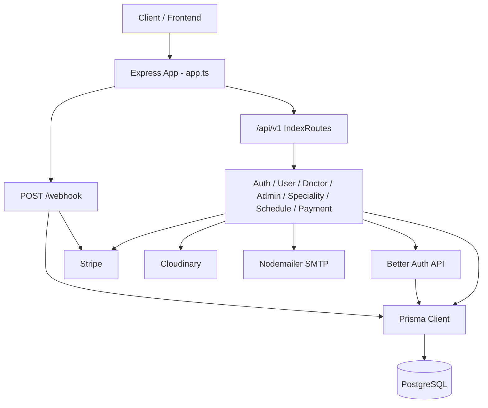
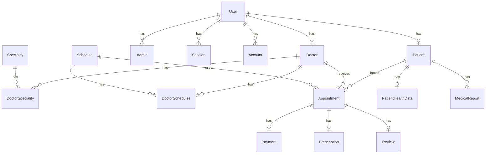

# ZenithHealth Backend — System Documentation

> **Source of truth:** Implementation under `server/`.  
> **Generated from codebase analysis** (not from assumptions).  
> Partial or missing functionality is explicitly marked.

---

## 1. Backend Overview

### What the backend is responsible for

The backend (`server/`) is an Express + TypeScript API for the **ZenithHealth Healthcare Management System**. It handles:

- Patient registration and authentication (Better Auth + custom JWT cookies)
- Admin and doctor account creation
- Doctor, admin, and speciality management
- Schedule slot generation and CRUD
- Stripe payment webhook processing for appointment checkout (appointment booking HTTP API is **not mounted**)

### Main business domains / modules

| Module | Path | Status |
| ------ | ---- | ------ |
| Auth | `server/src/app/modules/auth/` | Complete (mounted) |
| User (create doctor/admin) | `server/src/app/modules/user/` | Partial |
| Doctor | `server/src/app/modules/doctor/` | Partial (no auth on routes) |
| Admin | `server/src/app/modules/admin/` | Partial |
| Speciality | `server/src/app/modules/speciality/` | Partial |
| Schedule | `server/src/app/modules/schedule/` | Complete (mounted) |
| Payment | `server/src/app/modules/payment/` | Partial (webhook works; create-intent miswired) |
| Appointment | `server/src/app/modules/appointment/` | Partial / In Progress (not mounted) |
| Doctor Schedule | `server/src/app/modules/doctorschedule/` | Partial / In Progress (stubs; not mounted) |
| Patient / Prescription / Review / MedicalReport / PatientHealthData | Prisma models only | Not Implemented / Missing (no HTTP modules) |

### Backend architecture

Layered modular monolith:

```text
HTTP → Express App → /api/v1 Router → Module Routes
  → Middleware (auth / validation / multer)
  → Controller (catchAsync + sendResponse)
  → Service (business logic + Prisma / Better Auth / Stripe)
  → PostgreSQL (via Prisma)
```

### Application entry point

- **Bootstrap:** `server/src/server.ts` — calls `app.listen(envVars.PORT)`
- **App factory:** `server/src/app.ts` — middleware, routes, error handlers

### Request lifecycle (mounted APIs)

```text
HTTP Request
    ↓
CORS + cookieParser + express.json / urlencoded
    ↓
IndexRoutes (/api/v1)  OR  POST /webhook  OR  GET /
    ↓
Module Router
    ↓
Optional: checkAuth(...roles)
    ↓
Optional: validateRequest(zodSchema) / multerUpload
    ↓
Controller (catchAsync)
    ↓
Service
    ↓
Prisma / Better Auth API / Stripe / Cloudinary / Nodemailer
    ↓
sendResponse  OR  globalErroHandler / notFound
```

### How modules communicate

Modules do **not** use an event bus or shared message layer. Controllers call their own services; services call:

- Shared `prisma` client (`server/src/app/lib/prisma.ts`)
- Shared `auth` Better Auth instance (`server/src/app/lib/auth.ts`)
- Shared configs/utils (env, stripe, cloudinary, email, JWT, cookies, QueryBuilder)

### Database communication

Prisma Client 7 with `@prisma/adapter-pg` against PostgreSQL. Schema is multi-file under `server/prisma/schema/`. Client is generated to `server/src/generated/prisma/`.

### External services / integrations

| Service | Purpose | Status |
| ------- | ------- | ------ |
| Better Auth | Email/password auth, sessions, OTP | Used via `auth.api.*` (HTTP handler **not** mounted) |
| Nodemailer + EJS | OTP emails | Implemented |
| Cloudinary + Multer | Speciality icon upload | Implemented |
| Stripe | Checkout sessions + webhooks | Partial (booking path unmounted; webhook mounted) |

### Architectural pattern

**Modular monolith** with controller → service → Prisma data access. No separate repository layer. Auth is a **hybrid**: Better Auth sessions + custom JWT access/refresh cookies, both required by `checkAuth`.



---

## 2. Technology Stack

| Category | Technology | Purpose |
| ------------------- | -------------------------- | ----------------------------------------- |
| Runtime | Node.js (ESM) | Server runtime (`"type": "module"`) |
| Framework | Express 5.2.1 | HTTP API |
| Language | TypeScript 5.9 | Application language |
| Database | PostgreSQL | Primary datastore |
| ORM / Query Builder | Prisma 7.4 + `@prisma/adapter-pg` | Schema, migrations, queries |
| Authentication | better-auth 1.4 + jsonwebtoken | Sessions + custom JWT cookies |
| Validation | Zod 4 | Request body schemas |
| File Storage | Cloudinary + multer-storage-cloudinary | Uploads (speciality icons) |
| Payments | Stripe 22 | Checkout + webhooks |
| Email | Nodemailer + EJS | OTP / password-reset emails |
| Date utilities | date-fns | Schedule slot generation |
| HTTP status helpers | http-status | Status code constants |
| Env loading | dotenv | Environment configuration |
| Package manager | pnpm 10.30.3 | Dependency management |
| Dev runner | tsx | `pnpm dev` watch mode |

**Not present in codebase:** Redis/caching layer, job queues, Swagger/OpenAPI, rate limiting middleware, CI config in `server/`, seeders, automated tests (beyond placeholder script).

---

## 3. Backend Project Structure

```text
server/
├── src/
│   ├── server.ts                 # Process entry: listen on PORT
│   ├── app.ts                    # Express app, middleware, route mounts
│   ├── app/
│   │   ├── config/               # env, cloudinary, multer, stripe
│   │   ├── lib/                  # prisma client, better-auth instance
│   │   ├── middleware/           # checkAuth, validateRequest, errors, 404
│   │   ├── modules/              # Domain modules (auth, user, doctor, …)
│   │   ├── routes/index.ts       # /api/v1 aggregator
│   │   ├── shared/               # catchAsync, sendResponse
│   │   ├── utils/                # jwt, cookie, token, email, queryBuilder
│   │   ├── errorHelpers/         # AppError, Zod error mapper
│   │   ├── interfaces/           # Shared TS types / Express augmentation
│   │   └── templates/otp.ejs     # Email OTP template
│   └── generated/prisma/         # Generated Prisma client (do not hand-edit)
├── prisma/
│   ├── schema/                   # Multi-file Prisma schema
│   └── migrations/               # SQL migrations
├── prisma.config.ts              # Prisma 7 config (schema path, DATABASE_URL)
├── package.json
├── Dockerfile
├── .env.example
└── prd.md                        # Older product notes (may drift from code)
```

### Important directories

| Directory | Responsibility | Architectural role |
| --------- | -------------- | ------------------ |
| `src/app/modules/*` | Domain routes, controllers, services, validators | Primary business logic |
| `src/app/middleware/` | Auth, validation, global error, 404 | Cross-cutting HTTP concerns |
| `src/app/lib/` | Shared Prisma + Better Auth | Infrastructure singletons |
| `src/app/config/` | Env + third-party clients | Configuration |
| `src/app/utils/` | JWT, cookies, email, QueryBuilder | Shared helpers |
| `prisma/schema/` | Data model | Database source of truth |
| `src/generated/prisma/` | Generated client/types/enums | ORM runtime |

There is **no** dedicated `repositories/` folder; services talk to Prisma directly.

---

## 4. Application Bootstrap & Configuration

### Initialization order

```text
1. Import envVars (dotenv + required-env validation) — fails fast if missing
2. Import prisma (PrismaPg adapter + PrismaClient)
3. Import better-auth instance (auth.ts)
4. Build Express app (app.ts):
   a. query parser (qs)
   b. CORS (FRONTEND_URL, credentials: true)
   c. express.urlencoded
   d. express.json
   e. cookieParser
   f. POST /webhook (raw body intended; see security notes)
   g. /api/v1 → IndexRoutes
   h. GET /
   i. globalErroHandler
   j. notFound
5. server.ts → app.listen(PORT)
```

### Entry point

`server/src/server.ts`:

- Calls `bootstrap()` → `app.listen(envVars.PORT)`
- Empty `catch` on listen errors (**no meaningful logging / exit**)
- **No graceful shutdown** (no `SIGTERM`/`SIGINT` handlers, no Prisma disconnect)

### Environment configuration

Loaded and validated in `server/src/app/config/env.ts`. Required variable **names** (values omitted):

| Variable | Used for |
| -------- | -------- |
| `NODE_ENV` | Dev vs prod error detail |
| `PORT` | Listen port |
| `FRONTEND_URL` | CORS + Stripe success/cancel URLs |
| `DATABASE_URL` | PostgreSQL |
| `BETTER_AUTH_SECRET` | Better Auth |
| `BETTER_AUTH_URL` | Better Auth trusted origin |
| `ACCESS_TOKEN_SECRET` / `REFRESH_TOKEN_SECRET` | JWT signing |
| `ACCESS_TOKEN_EXPIRES_IN` / `REFRESH_TOKEN_EXPIRES_IN` | JWT TTL |
| `BETTER_AUTH_SESSION_EXPIRES_IN` / `BETTER_AUTH_SESSION_TOKEN_UPDATE_AGE` | Loaded in env — **not wired** into `lib/auth.ts` session config |
| `EMAIL_SENDER_SMTP_*` | Nodemailer |
| `CLOUDINARY_CLOUD_NAME` / `CLOUDINARY_API_KEY` / `CLOUDINARY_API_SECRET` | Cloudinary |
| `STRIPE_SECRET_KEY` / `WEBHOOK_SECRET` | Stripe |

**Discrepancy:** `.env.example` uses `CLOUDINARY_SECRET_KEY` and omits Stripe / `FRONTEND_URL`; `env.ts` requires `CLOUDINARY_API_SECRET`, `FRONTEND_URL`, and Stripe keys.

### Middleware registration (`app.ts`)

1. CORS  
2. urlencoded  
3. JSON  
4. cookieParser  
5. Route mounts  
6. Global error handler  
7. Not-found handler  

### Route registration

`server/src/app/routes/index.ts` mounts:

| Prefix | Module |
| ------ | ------ |
| `/auth` | AuthRoutes |
| `/speciality` | SpecialityRoutes |
| `/users` | userRoutes |
| `/doctors` | DoctorRoutes |
| `/admin` | adminRoutes |
| `/schedule` | scheduleRoutes |
| `/payment` | paymentRoutes |

Commented (not active):

- `/doctor-schedules`
- `/appointments`

### Database initialization

Prisma connects lazily on first query via `PrismaPg` adapter. No explicit connect/migrate step in `server.ts`. Migrations are run via CLI (`pnpm migrate` / `pnpm setup`).

### Logging

- `console.log` / `console.error` in various services and middleware
- Dev-only error dump in `globalErroHandler`
- No structured logging library (Winston/Pino/etc.)

### Graceful shutdown

**Not Implemented / Missing.**

---

## 5. API Architecture

### Routing strategy

- Versioned under `/api/v1`
- Per-module Express routers
- Stripe webhook at root `POST /webhook` (outside version prefix)

### API versioning

Single version prefix: `/api/v1`. No multi-version strategy.

### Controllers / handlers

Thin controllers wrapped in `catchAsync`. Success responses via `sendResponse`.

### Middleware

| Middleware | File | Role |
| ---------- | ---- | ---- |
| `checkAuth(...roles)` | `middleware/checkAuth.ts` | Dual session + JWT + role gate |
| `validateRequest(schema)` | `middleware/validateRequest.ts` | Zod parse (supports multipart `data` JSON string) |
| `multerUpload` | `config/multer.config.ts` | Cloudinary upload |
| `globalErroHandler` | `middleware/globalErroHandler.ts` | Central errors |
| `notFound` | `middleware/notfound.ts` | 404 |

### Services

Contain business rules and Prisma/Stripe/Better Auth calls. No repository abstraction.

### DTOs / schemas

- Zod schemas in module `*.validator.ts` / `*.validation.ts` / `*.validate.ts`
- TypeScript interfaces in `*.interface.ts`
- Auth routes have **no** Zod validation wired

### Response formatting

Success (`sendResponse`):

```json
{
  "success": true,
  "message": "...",
  "data": {},
  "meta": { "page": 1, "limit": 10, "total": 0, "totalPages": 0 }
}
```

Error (`globalErroHandler`):

```json
{
  "success": false,
  "message": "...",
  "errorSource": [{ "path": "", "message": "..." }],
  "stack": "...",
  "error": "..."
}
```

`stack` / `error` only in development.

### HTTP status conventions (observed)

| Code | Typical use |
| ---- | ----------- |
| 200 | Success reads / updates |
| 201 | Create / login (login uses 201) |
| 400 | Bad request / business validation via AppError |
| 401 | Missing/invalid session or tokens |
| 403 | Wrong role / blocked / deleted |
| 404 | Not found (AppError or notFound middleware) |
| 500 | Unhandled errors |

### Actual request lifecycle

```text
HTTP Request
    ↓
CORS / parsers / cookies
    ↓
Router (/api/v1/...)
    ↓
checkAuth (when applied) — Better Auth session cookie + accessToken JWT
    ↓
validateRequest / multer (when applied)
    ↓
Controller
    ↓
Service
    ↓
Prisma / external API
    ↓
sendResponse  |  globalErroHandler
```

---

## 6. Complete API Inventory

### Mounted endpoints

| Method | Endpoint | Module | Purpose | Auth | Permission/Role |
| ------ | -------- | ------ | ------- | ---- | --------------- |
| GET | `/` | App | Health-ish hello string | No | — |
| POST | `/webhook` | Payment | Stripe webhook handler | Stripe signature | — |
| POST | `/api/v1/auth/register` | Auth | Register patient | No | — |
| POST | `/api/v1/auth/login` | Auth | Login | No | — |
| POST | `/api/v1/auth/me` | Auth | Current user profile | Yes | ADMIN, DOCTOR, PATIENT, SUPER_ADMIN |
| POST | `/api/v1/auth/refresh-token` | Auth | Rotate JWTs + extend session | Cookies | — |
| POST | `/api/v1/auth/change-password` | Auth | Change password | Yes | All four roles |
| POST | `/api/v1/auth/logout` | Auth | Sign out + clear cookies | Yes | All four roles |
| POST | `/api/v1/auth/verify-email` | Auth | Verify email OTP | No | — |
| POST | `/api/v1/auth/forget-password` | Auth | Request reset OTP | No | — |
| POST | `/api/v1/auth/reset-password` | Auth | Reset password with OTP | No | — |
| POST | `/api/v1/users/create-doctor` | User | Create doctor account | **No** | — |
| POST | `/api/v1/users/create-admin` | User | Create admin account | Yes | SUPER_ADMIN |
| GET | `/api/v1/doctors` | Doctor | List doctors (paginated) | **No** | — |
| GET | `/api/v1/doctors/:id` | Doctor | Get doctor by id | **No** | — |
| PUT | `/api/v1/doctors/:id` | Doctor | Update doctor | **No** | — |
| PATCH | `/api/v1/doctors/:id` | Doctor | Soft-delete doctor | **No** | — |
| GET | `/api/v1/admin` | Admin | List admins | Yes | ADMIN, SUPER_ADMIN, PATIENT |
| GET | `/api/v1/admin/:id` | Admin | Get admin by id | **No** | — |
| PUT | `/api/v1/admin/:id` | Admin | Update admin | Yes | SUPER_ADMIN |
| DELETE | `/api/v1/admin/:id` | Admin | Soft-delete admin | Yes | SUPER_ADMIN |
| POST | `/api/v1/speciality/create-speciality` | Speciality | Create speciality (+ file) | **No** (auth commented) | — |
| GET | `/api/v1/speciality` | Speciality | List specialities | Yes | PATIENT only |
| DELETE | `/api/v1/speciality/:id` | Speciality | Hard-delete speciality | Yes | ADMIN, SUPER_ADMIN |
| PATCH | `/api/v1/speciality/:id` | Speciality | Update speciality | Yes | ADMIN, SUPER_ADMIN |
| POST | `/api/v1/schedule` | Schedule | Generate schedule slots | Yes | ADMIN, SUPER_ADMIN |
| GET | `/api/v1/schedule` | Schedule | List schedules | Yes | ADMIN, SUPER_ADMIN, DOCTOR |
| GET | `/api/v1/schedule/:id` | Schedule | Get schedule | Yes | ADMIN, SUPER_ADMIN, DOCTOR |
| PATCH | `/api/v1/schedule/:id` | Schedule | Update schedule | Yes | ADMIN, SUPER_ADMIN |
| DELETE | `/api/v1/schedule/:id` | Schedule | Delete schedule | Yes | ADMIN, SUPER_ADMIN |
| POST | `/api/v1/payment/create-payment-intent` | Payment | **Miswired** to webhook handler | Yes | PATIENT |

### Not mounted (code exists)

| Area | Notes |
| ---- | ----- |
| Appointment routes | `appointment.routes.ts` is empty; mount commented in `IndexRoutes` |
| Doctor-schedule routes | `doctorschedule.routes.ts` is empty; mount commented |
| `/users/create-superadmin` | Commented out |

---

### Important endpoints (detail)

#### API: `POST /api/v1/auth/register`

**Purpose:** Register a patient (Better Auth user + Patient row).

**Authentication:** None  

**Authorization:** N/A  

**Request Body:**

```json
{
  "name": "string",
  "email": "string",
  "password": "string"
}
```

**Validation Rules:**

* No route-level Zod schema
* Better Auth enforces its own password/email rules

**Success Response:** `201` — user, patient, `token` (session), `accessToken`, `refreshToken`; cookies set.

**Possible Errors:**

```text
500 Failed to register / transaction rollback
```

**Implementation:**

* Route: `server/src/app/modules/auth/auth.routes.ts`
* Controller: `auth.controller.ts` → `registerPatient`
* Service: `auth.services.ts` → `registerPatient`
* Related model: `User`, `Patient`, `Session`, `Account`

---

#### API: `POST /api/v1/auth/login`

**Purpose:** Sign in and issue dual cookies (session + JWTs).

**Request Body:**

```json
{
  "email": "string",
  "password": "string"
}
```

**Business rule:** Blocks login if `user.status === BLOCKED`.

**Success:** `201` with tokens + cookies.

**Implementation:** `auth.routes.ts` → `AuthController.loginUser` → `authService.loginUser`

---

#### API: `POST /api/v1/auth/me`

**Purpose:** Return authenticated user with nested patient/doctor relations.

**Authentication:** `checkAuth` — requires `better-auth.session_token` **and** `accessToken` cookies.

**Success:** `200` user object with deep includes.

---

#### API: `POST /api/v1/auth/refresh-token`

**Purpose:** Verify refresh JWT + existing session; issue new access/refresh JWTs; bump session `expiresAt`.

**Cookies required:** `refreshToken`, `better-auth.session_token`

---

#### API: `POST /api/v1/auth/change-password`

**Body:** `{ "currentPassword", "newPassword" }`  
Clears `needPasswordChange` if set; revokes other Better Auth sessions; re-issues JWTs.

---

#### API: `POST /api/v1/auth/logout`

Signs out via Better Auth bearer session; clears `accessToken`, `refreshToken`, `better-auth.session_token` cookies.

---

#### API: `POST /api/v1/auth/verify-email`

**Body:** `{ "email", "otp" }` — Better Auth `verifyEmailOTP`; may force `emailVerified: true` if OTP succeeds without user payload.

---

#### API: `POST /api/v1/auth/forget-password`

**Body:** `{ "email" }`  
Requires existing, verified, non-deleted/non-blocked user → sends OTP email.

---

#### API: `POST /api/v1/auth/reset-password`

**Body:** `{ "email", "otp", "newPassword" }`  
Resets via Better Auth OTP; deletes all user sessions.

---

#### API: `POST /api/v1/users/create-doctor`

**Purpose:** Create doctor user + Doctor profile + DoctorSpeciality links.

**Authentication:** **None** (security gap)

**Request Body (validated):**

```json
{
  "password": "string (>=6)",
  "doctor": {
    "name": "string (5-50)",
    "email": "string",
    "registrationNumber": "string",
    "experience": 0,
    "gender": "MALE|FEMALE|OTHER",
    "appointmentFee": 0,
    "qualifications": "string",
    "currentWorkingPlace": "string",
    "designation": "string",
    "profilePhoto": "optional",
    "contactNumber": "optional 11-14",
    "address": "optional"
  },
  "specialities": ["specialityId", "..."]
}
```

**Business rules:**

* Each speciality id must exist
* Email must not already exist on User
* `needPasswordChange: true`, role `DOCTOR`
* On profile TX failure, deletes created User

**Partial:** Service does **not `return`** the created doctor from `createDoctor` (missing return after transaction).

**Implementation:** `user.route.ts` → `userController.createDoctor` → `UserService.createDoctor`

---

#### API: `POST /api/v1/users/create-admin`

**Auth:** SUPER_ADMIN + Zod `createAdminZodSchema`  
Creates ADMIN user + Admin row; rolls back user on failure.

---

#### API: `GET /api/v1/doctors`

**Auth:** None  
QueryBuilder: search, filter, paginate, sort, dynamic include. Always `isDeleted: false`.

---

#### API: `GET /api/v1/doctors/:id`

Includes user, specialities, appointments, schedules, reviews. Soft-deleted excluded.

---

#### API: `PUT /api/v1/doctors/:id`

Updates doctor fields and specialities (`shouldDelete` / upsert) in a transaction.  
**Auth:** None. Zod `updateDoctorZodSchema` exists but is **not wired**.

---

#### API: `PATCH /api/v1/doctors/:id`

Soft-deletes doctor + user, deletes sessions and doctorSpeciality rows. **Auth:** None.

---

#### API: `GET /api/v1/admin`

**Auth:** ADMIN | SUPER_ADMIN | PATIENT — returns all admins with user include. **No pagination.**

---

#### API: `GET /api/v1/admin/:id`

**Auth:** None — returns admin + user or 404.

---

#### API: `PUT /api/v1/admin/:id` / `DELETE /api/v1/admin/:id`

SUPER_ADMIN only. Delete soft-deletes admin/user, sets `UserStatus.DELETED`, wipes sessions & accounts; blocks self-delete.

---

#### API: `POST /api/v1/speciality/create-speciality`

Multipart: `file` + body/`data` JSON `{ title, description? }`. Icon = uploaded Cloudinary path. Auth middleware commented out.

---

#### API: `GET /api/v1/speciality`

PATIENT only. Returns all specialities (no soft-delete filter).

---

#### API: `DELETE|PATCH /api/v1/speciality/:id`

ADMIN | SUPER_ADMIN. Delete is **hard** delete despite `isDeleted` column.

---

#### API: `POST /api/v1/schedule`

ADMIN | SUPER_ADMIN. Expands date range into **30-minute** slots; skips duplicate start/end pairs.

**Body:**

```json
{
  "startDate": "ISO date string",
  "endDate": "ISO date string",
  "startTime": "HH:mm",
  "endTime": "HH:mm"
}
```

---

#### API: `GET /api/v1/schedule` / `GET|PATCH|DELETE /api/v1/schedule/:id`

As inventory table. List uses QueryBuilder pagination.

---

#### API: `POST /webhook`

Stripe signature verification → `PaymentService.handleStripeWebhook`. On `checkout.session.completed`, updates appointment + payment to PAID/UNPAID; idempotent via `stripeEventId`.

---

#### API: `POST /api/v1/payment/create-payment-intent`

**Partial / miswired:** Route name suggests payment-intent creation, but handler is `PaymentController.handleStripeWebhook` (expects Stripe signature). Not a usable patient payment-intent API.

---

## 7. Authentication

### Implemented mechanisms

| Mechanism | Status |
| --------- | ------ |
| Patient registration | Implemented |
| Login | Implemented |
| Logout | Implemented |
| Password hashing | Via Better Auth (Account.password) |
| Password verification | Via Better Auth `signInEmail` |
| Session management | Better Auth Session table + cookie |
| Access tokens | Custom JWT cookie `accessToken` |
| Refresh tokens | Custom JWT cookie `refreshToken` |
| Token expiration | Env-driven JWT TTL; cookie maxAge 1d / 7d |
| Token rotation | Refresh endpoint issues new access+refresh |
| Email verification | OTP via emailOTP plugin |
| Forgot / reset password | OTP email flows |
| OAuth / social | **Not Implemented / Missing** |
| Better Auth HTTP routes | **Not mounted** (`toNodeHandler` unused) |

### Dual-token model

Protected routes require **both**:

1. Cookie `better-auth.session_token` → valid Prisma `Session` (`expiresAt > now`)
2. Cookie `accessToken` → valid JWT signed with `ACCESS_TOKEN_SECRET`

Role checks run against session user and JWT payload.

### Login flow

```text
POST /api/v1/auth/login
    ↓
auth.api.signInEmail
    ↓
Reject if BLOCKED
    ↓
Create access + refresh JWTs
    ↓
Set cookies: accessToken, refreshToken, better-auth.session_token
    ↓
Return user + tokens in body
```

### Register flow

```text
POST /api/v1/auth/register
    ↓
auth.api.signUpEmail (default PATIENT)
    ↓
$transaction → create Patient
    ↓
Issue JWTs + set cookies
    ↓
On Patient failure → delete User + rethrow
```

### Refresh flow

```text
POST /api/v1/auth/refresh-token
    ↓
Read refreshToken + session cookies
    ↓
Load Session from DB
    ↓
Verify refresh JWT
    ↓
Issue new JWTs
    ↓
Update session.expiresAt
    ↓
Set cookies + return tokens
```

### Password reset flow

```text
forget-password → validate user → requestPasswordResetEmailOTP → email OTP
reset-password → validate user → resetPasswordEmailOTP → deleteMany sessions
```

### Cookie security flags

`httpOnly: true`, `secure: true`, `sameSite: "none"`, `path: "/"`  
Access/session maxAge: 1 day; refresh: 7 days (`token.ts`).

### Auth middleware

`server/src/app/middleware/checkAuth.ts` — see Authorization section.

---

## 8. Authorization & Permissions

### Roles (`Role` enum)

`SUPER_ADMIN`, `ADMIN`, `DOCTOR`, `PATIENT`

### Permission model

**Role-based only** (no fine-grained permission table). Enforced in route definitions via `checkAuth(...roles)`.

### Permission matrix (mounted routes)

| Role | Module | Read | Create | Update | Delete |
| ---- | ------ | ---: | -----: | -----: | -----: |
| SUPER_ADMIN | Admin | Yes¹ | Yes (create-admin) | Yes | Yes |
| ADMIN | Admin list | Yes¹ | No | No | No |
| PATIENT | Admin list | Yes¹ | No | No | No |
| — | Admin by id | Public | — | — | — |
| SUPER_ADMIN / ADMIN | Speciality | No (list is PATIENT-only) | Public create² | Yes | Yes |
| PATIENT | Speciality list | Yes | No | No | No |
| SUPER_ADMIN / ADMIN | Schedule | Yes | Yes | Yes | Yes |
| DOCTOR | Schedule | Yes | No | No | No |
| Any authenticated role | Auth me / logout / change-password | Yes | — | — | — |
| PATIENT | Payment create-intent | — | Yes³ | — | — |
| Public | Doctors CRUD | Yes | Via users/create-doctor (public) | Yes | Soft-delete public |
| Public | Auth register/login/verify/forget/reset | — | Yes | — | — |

¹ Admin list allows ADMIN, SUPER_ADMIN, PATIENT.  
² Create speciality auth is commented out.  
³ Endpoint exists but is miswired to webhook handler.

### Resource ownership

- Admin delete: cannot delete self (`admin.service.ts`)
- Appointment booking (unmounted): patient resolved by `user.email`
- Doctor schedule controllers expect `req.user` ownership patterns but services are stubs

### Where authorization is enforced

Primarily **route middleware** (`checkAuth`). Services generally assume caller is already authorized (except self-delete check and status checks in auth).

---

## 9. Backend Modules & Business Logic

## Module: Auth

### Purpose

Patient registration, login/logout, session/JWT lifecycle, email verification, password change/reset.

### Business Rules

* Default role PATIENT on register
* Blocked users cannot login
* Forget/reset require verified, non-deleted, non-blocked users
* Change password revokes other sessions; clears `needPasswordChange`
* Refresh extends session expiry (hardcoded ms expression in service)

### Endpoints

See inventory `/api/v1/auth/*`.

### Source Files

* `auth.routes.ts`, `auth.controller.ts`, `auth.services.ts`, `auth.interface.ts`
* `lib/auth.ts`, `middleware/checkAuth.ts`, `utils/token.ts`, `utils/jwt.ts`, `utils/cookie.ts`

### External Dependencies

Better Auth, Nodemailer/EJS, Prisma.

---

## Module: User

### Purpose

Provision DOCTOR and ADMIN accounts (not patient — patients use auth register).

### Business Rules

* Doctor: validate specialities exist; `needPasswordChange: true`; create DoctorSpeciality rows
* Admin: SUPER_ADMIN only at route; `needPasswordChange: true`
* Rollback User on profile creation failure

### Endpoints

`POST /users/create-doctor`, `POST /users/create-admin`

### Partial issues

* `createDoctor` missing `return result`
* `create-doctor` unauthenticated
* Unused import `role` from better-auth plugins in route file

### Source Files

`user.route.ts`, `user.controller.ts`, `user.service.ts`, `user.validator.ts`, `user.interface.ts`

---

## Module: Doctor

### Purpose

List/get/update/soft-delete doctors.

### Business Rules

* Lists exclude `isDeleted: true`
* Update can add/remove specialities via `shouldDelete`
* Soft delete marks doctor + user deleted, clears sessions, removes speciality links

### Authorization

**None on routes** — Needs Review.

### Source Files

`doctor.routes.ts`, `doctor.controller.ts`, `doctor.service.ts`, `doctor.constants.ts`, `doctor.validation.ts` (unused on routes), `doctor.interface.ts`

---

## Module: Admin

### Purpose

Admin CRUD-ish management.

### Business Rules

* Soft delete + UserStatus.DELETED + wipe Session/Account
* Self-delete forbidden
* Update spreads `updateData.admin` without Zod

### Source Files

`admin.route.ts`, `admin.controller.ts`, `admin.service.ts`, `admin.validator.ts`, `admin.interface.ts`

---

## Module: Speciality

### Purpose

Medical speciality catalog with optional Cloudinary icon.

### Business Rules

* Create merges `icon: req.file?.path`
* Delete is hard delete (schema `isDeleted` unused)
* List restricted to PATIENT role only

### Source Files

`speciality.routes.ts`, `speciality.controller.ts`, `speciality.service.ts`, `speciality.validate.ts`, `speciality.validation.ts`

---

## Module: Schedule

### Purpose

Generate and manage time-slot `Schedule` records (global slots, not yet tied via mounted doctor-schedule API).

### Business Rules

* Create walks each day from `startDate`→`endDate`, slices `startTime`→`endTime` every **30 minutes**
* Skips existing identical `startDateTime`/`endDateTime`
* Uses `convertDateTime` timezone adjustment
* Hard delete

### Source Files

`schedule.route.ts`, `schedule.controller.ts`, `schedule.service.ts`, `schedule.validation.ts`, `schedule.utils.ts`, `schedule.constant.ts`, `schedule.interface.ts`

---

## Module: Payment

### Purpose

Stripe webhook processing; intended payment APIs.

### Business Rules

* Idempotent webhook via unique `stripeEventId`
* On `checkout.session.completed`: update Appointment.paymentStatus + Payment row
* Expired/failed events only logged

### Partial

* `/create-payment-intent` miswired
* Checkout session creation lives in unmounted appointment service

### Source Files

`payment.route.ts`, `payment.controller.ts`, `payment.service.ts`, `payment.interface.ts`, `config/stripe.config.ts`

---

## Module: Appointment — Partial / In Progress

### Purpose

Book appointment + create Payment + Stripe Checkout Session.

### Business Rules (service implemented)

* Resolve patient by authenticated email
* Doctor must exist and not be deleted
* DoctorSchedules composite key must exist
* Transaction: create Appointment (`videoCallingId`), mark schedule `isBooked`, create Payment, create Stripe Checkout (`currency: "bdt"`, `unit_amount: fee * 122`)
* Returns `paymentUrl`

### Endpoints

**Not mounted.** `appointment.routes.ts` and `appointment.validation.ts` are empty files. Controller defines `bookAppointment` but does not export an `AppointmentController` object. `getMyAppointments` is an incomplete stub.

### Bugs / gaps

* `import { uuidv7 } from "zod"` is incorrect
* Unused `import app from "../../../app"`
* Stripe Checkout call inside DB transaction (external side-effect)

### Source Files

`appointment.service.ts`, `appointment.controller.ts`, `appointment.interface.ts`

---

## Module: Doctor Schedule — Partial / In Progress

### Purpose

Assign schedules to doctors (`DoctorSchedules`).

### Status

* Service methods are empty stubs
* Controller implemented against expected service API (signature mismatches with stubs)
* Routes file empty; IndexRoutes mount commented
* constant/utils/validator files empty

### Source Files

`doctorschedule.controller.ts`, `doctorschedule.service.ts`, `doctorschedule.interface.ts`, empty route/validator/constant/utils

---

## Modules: Patient / Prescription / Review / MedicalReport / PatientHealthData

### Status

**Not Implemented / Missing** as HTTP modules. Models exist in Prisma; Patient is created during register; related data is returned nested under `/auth/me` for patients/doctors when present.

---

## 10. Database & Data Model

### Technology

PostgreSQL + Prisma 7 multi-file schema (`server/prisma/schema/`).

### Soft deletion

| Entity | Soft delete fields | Used in services? |
| ------ | ------------------ | ----------------- |
| User | `isDeleted`, `deletedAt`, `status` | Yes |
| Doctor | `isDeleted`, `deletedAt` | Yes |
| Admin | `isDeleted`, `deletedAt` | Yes (status also set on user) |
| Patient | `isDeleted`, `deletedAt` | Schema only |
| Speciality | `isDeleted` | Schema only (hard delete used) |

### Enums

See `enums.prisma`: `Role`, `UserStatus`, `Gender`, `BloodGroup`, `AppointmentStatus`, `PaymentStatus`.

### Entity: `User` (`user`)

| Field | Type | Required | Default | Description |
| ----- | ---- | -------- | ------- | ----------- |
| id | String | Yes | (Better Auth) | PK |
| name | String | Yes | — | Display name |
| email | String | Yes | — | Unique |
| emailVerified | Boolean | Yes | false | Email verified flag |
| role | Role | Yes | PATIENT | Role |
| status | UserStatus | Yes | ACTIVE | ACTIVE/BLOCKED/DELETED |
| needPasswordChange | Boolean | Yes | false | Force password change |
| isDeleted | Boolean | Yes | false | Soft delete |
| deletedAt | DateTime? | No | null | Soft delete time |
| image | String? | No | null | Avatar |
| createdAt / updatedAt | DateTime | Yes | now / auto | Timestamps |

```text
User
 ├── hasMany → Session, Account, Admin
 ├── hasOne  → Patient?
 └── hasOne  → Doctor?
```

### Entity: `Session` / `Account` / `Verification`

Better Auth tables (`session`, `account`, `verification`) — passwords live on `Account.password`; sessions cascade on user delete.

### Entity: `Patient` (`patient`)

| Field | Type | Required | Default | Description |
| ----- | ---- | -------- | ------- | ----------- |
| id | String uuid7 | Yes | uuid(7) | PK |
| name / email | String | Yes | — | email unique |
| profilePhoto / contactNumber / address | String? | No | — | Profile |
| isDeleted / deletedAt | Soft delete | — | false / null | Unused in services |
| userId | String | Yes | — | Unique FK → User |

```text
Patient
 ├── belongsTo → User
 ├── hasMany → Appointment, Prescription, Review, MedicalReport
 └── hasOne → PatientHealthData?
```

### Entity: `Doctor` (`doctor`)

Professional profile with `appointmentFee`, `gender`, `averageRating`, indexes on `email`, `isDeleted`.

```text
Doctor
 ├── belongsTo → User
 ├── hasMany → DoctorSpeciality, DoctorSchedules, Appointment, Prescription, Review
```

### Entity: `Admin` (`admins`)

Admin profile linked 1:1 to User.

### Entity: `Speciality` (`specialities`)

Unique `title`; optional `description`, `icon`; `isDeleted` flag.

### Entity: `Schedule` / `DoctorSchedules`

* `Schedule`: `startDateTime`, `endDateTime`
* `DoctorSchedules`: composite PK `(doctorId, scheduleId)`, `isBooked`

### Entity: `Appointment` (`appointments`)

| Field | Type | Notes |
| ----- | ---- | ----- |
| videoCallingId | Uuid unique | Generated at booking |
| status | AppointmentStatus | default SCHEDULED |
| paymentStatus | PaymentStatus | default UNPAID |
| patientId / doctorId / scheduleId | FKs | Cascades |

1:1 optional: Prescription, Review, Payment.

### Entity: `Payment` (`payments`)

`amount`, unique `transactionId` (uuid), optional unique `stripeEventId`, `status`, `paymentGatewayData` Json, 1:1 `appointmentId`.

### Entity: `Prescription` / `Review` / `MedicalReport` / `PatientHealthData`

Schema-complete; **no module APIs**.

### ER diagram (implemented relations)



---

## 11. Database Migrations & Seeders

### Migration system

Prisma Migrate. Config: `server/prisma.config.ts`  
Schema folder: `prisma/schema`  
Migrations: `prisma/migrations/`

### Migration files (chronological)

| Migration | Folder |
| --------- | ------ |
| init | `20260213141705_init` |
| init | `20260213195429_init` |
| init | `20260213200309_init` |
| init | `20260214105922_init` |
| doctor | `20260215065238_doctor` |
| admin | `20260224110405_admin` |
| models | `20260224160748_models` |
| models | `20260224161107_models` |
| init | `20260406094324_init` |
| init | `20260412151242_init` |

### Seeders

**Not Implemented / Missing** — no seed scripts / initial SUPER_ADMIN seeder found.

### Commands (`package.json`)

| Script | Command |
| ------ | ------- |
| generate | `prisma generate` |
| migrate | `prisma migrate dev` |
| setup | `prisma generate && prisma migrate dev` |
| push | `prisma db push` |
| pull | `prisma db pull` |
| studio | `prisma studio` |

### Rollback

Standard Prisma migrate workflow; no custom rollback docs/scripts in repo.

---

## 12. Transactions & Data Consistency

### Implemented `$transaction` usage

| Location | Purpose |
| -------- | ------- |
| `auth.services` register | Create Patient |
| `user.service` createDoctor / createAdmin | Profile (+ specialities) |
| `doctor.service` update / delete | Profile/specialities; soft-delete cascade |
| `admin.service` delete | Soft-delete + session/account wipe |
| `appointment.service` book | Appointment + book slot + payment + Stripe session |
| `payment.service` webhook | Appointment + payment status update |

### Race-condition / locking

* Schedule create checks duplicates with `findFirst` then `create` — **not atomic** (TOCTOU race possible)
* Booking marks `isBooked` without checking prior `isBooked === false` inside transaction — double-booking risk
* No pessimistic/optimistic locking beyond unique constraints

### Idempotency

* Stripe webhook: `stripeEventId` unique + early return if exists — **implemented**

### Potential improvements (not claiming bugs as exploits)

* Move Stripe API call outside DB transaction
* Enforce `isBooked: false` condition when booking
* Atomic schedule uniqueness constraint if required
* Return value from `createDoctor` transaction

---

## 13. Validation

### Layers

```text
Input
 ↓
Zod schema (when validateRequest wired)
 ↓
Service business checks (existence, status, self-delete, etc.)
 ↓
Database constraints (unique email, FKs, enums)
```

### Where Zod is used

| Module | Schema | Wired? |
| ------ | ------ | ------ |
| User | createDoctor / createAdmin | Yes |
| Speciality | CreateSpeciality | Yes |
| Schedule | create / update | Yes |
| Doctor | updateDoctorZodSchema | **No** |
| Auth | — | **No** |
| Admin update | — | **No** |
| Appointment | empty validation file | **No** |

### Multipart

`validateRequest` parses `req.body.data` JSON string when present (file uploads).

### File validation

Multer accepts uploads via Cloudinary storage; **no explicit MIME allowlist / size limit** in `multer.config.ts`.

### validateRequest caveat

On Zod failure it calls `next(error)` then still assigns `req.body = parseData.data` and calls `next()` again (**missing `return`**) — Potential bug.

---

## 14. Error Handling

### Global handler

`server/src/app/middleware/globalErroHandler.ts`

* ZodError → `hadnleZodError` → field `errorSource`
* AppError → status + message
* Generic Error → 500
* Deletes uploaded Cloudinary files on error when `req.file` / `req.files` present

### Custom exception

`AppError` (`errorHelpers/AppError.ts`) — `statusCode` + `message`.

### Not found

`middleware/notfound.ts` → 404 JSON.

### Async wrapper

`shared/catchAsync.ts` forwards errors to `next`.

### Logging

Console in development for global errors; various `console.log` in auth middleware and services. No redaction of tokens (auth middleware logs session/access tokens — security concern).

---

## 15. Security

### Implemented Security Controls

* Password hashing via Better Auth accounts
* Dual cookie auth (session + JWT) on protected routes
* HttpOnly cookies for tokens
* Role checks via `checkAuth`
* Email verification required in Better Auth config
* OTP expiry 10 minutes, length 6
* CORS restricted to `FRONTEND_URL` with credentials
* Stripe webhook signature verification (`constructEvent`)
* Env required-variable fail-fast
* Prisma parameterized queries (SQL injection mitigation)
* Soft-delete + status gates for blocked/deleted users on auth middleware
* Cloudinary cleanup on request errors after upload

### Potential Security Gaps

| Issue | Where | Why it matters | Suggested remediation |
| ----- | ----- | -------------- | --------------------- |
| Unauthenticated doctor create/update/delete | `user.route.ts`, `doctor.routes.ts` | Anyone can mutate doctor data | Require ADMIN/SUPER_ADMIN (and ownership rules) |
| Create speciality auth commented out | `speciality.routes.ts` | Unauthenticated catalog writes | Re-enable `checkAuth` |
| Public `GET /admin/:id` | `admin.route.ts` | Admin PII exposure | Require auth + role |
| Tokens logged to console | `checkAuth.ts` | Credential leakage in logs | Remove token logs |
| Access/refresh tokens also returned in JSON body | auth controller | Increases XSS token theft surface if body cached/logged | Prefer cookie-only |
| `secure: true` + `sameSite: none` always | `token.ts` | Local HTTP may break; intentional for cross-site | Document; env-toggle for dev |
| Stripe webhook after `express.json()` | `app.ts` | Raw body may be consumed → signature failures / weaker verify | Mount webhook **before** JSON parser with `express.raw` only |
| No rate limiting | Global | Brute-force on login/OTP | Add rate limiting |
| No CSRF strategy beyond SameSite | Auth cookies | Cross-site cookie use with `none` | Review CSRF for cookie auth |
| Multer without size/type limits | `multer.config.ts` | Large/malicious uploads | Restrict MIME + size |
| `.env.example` / env name mismatch | Cloudinary key names | Misconfiguration risk | Align names |
| `create-payment-intent` miswired | `payment.route.ts` | Confusing / broken payment surface | Implement real intent or remove |
| Session TTL hardcoded / env unused | `lib/auth.ts` | Config drift | Wire env vars |

---

## 16. File Upload & Storage

### Implemented

* **Endpoint:** `POST /api/v1/speciality/create-speciality` with field `file`
* **Provider:** Cloudinary via `multer-storage-cloudinary`
* **Folders:** `ZenithHealthcare/images` or `ZenithHealthcare/pdfs` (by extension)
* **Filename:** random + timestamp + sanitized original base name
* **Access:** Cloudinary URL stored on `Speciality.icon`
* **Cleanup:** Global error handler deletes uploaded file(s) on failure
* Helpers: `uploadFileToCloudinary(buffer)`, `deleteFileFromCloudinary(url)` in `cloudinary.config.ts`

### Not implemented

* Dedicated download/delete APIs for medical reports
* Explicit MIME allowlist / max size
* Private signed URL strategy for sensitive medical files

### Upload lifecycle (speciality)

```text
Multipart request
  ↓
multerUpload.single("file") → Cloudinary
  ↓
validateRequest (parse body.data if present)
  ↓
Controller merges icon path
  ↓
SpecialityService.create
  ↓
On later error → delete Cloudinary asset
```

---

## 17. External Services & Integrations

### Better Auth

* **Purpose:** Email/password auth, sessions, OTP plugins
* **Config:** `server/src/app/lib/auth.ts`
* **Auth method:** API calls from services (`auth.api.*`) with Bearer session headers where needed
* **Plugins:** `bearer()`, `emailOTP`
* **HTTP mount:** Missing

### Nodemailer + EJS

* **Purpose:** Send OTP emails (verify / forget-password)
* **File:** `utils/email.ts`, template `templates/otp.ejs`
* **Config:** `EMAIL_SENDER_SMTP_*`
* **Retry:** None beyond throw AppError

### Cloudinary

* **Purpose:** Image/PDF storage for speciality icons (and helpers for future use)
* **Config:** `CLOUDINARY_*`
* **SDK:** `cloudinary` v2

### Stripe

* **Purpose:** Checkout Session (booking service) + webhook payment confirmation
* **Config:** `STRIPE_SECRET_KEY`, `WEBHOOK_SECRET`
* **Script:** `pnpm stripe:webhook` → forward to `localhost:5000/webhook`
* **Retry / timeout:** Library defaults; expired/failed events only logged

### OAuth / SMS / AI / Maps

**Not Implemented / Missing.**

---

## 18. Background Jobs, Queues & Cron

**Not Implemented / Missing.** No Bull/BullMQ/Agenda/cron workers found. All work is request-synchronous (including Stripe API inside booking transaction).

---

## 19. Caching

| Mechanism | Status |
| --------- | ------ |
| Redis / Memcached | Not present |
| Application cache | Not present |
| Better Auth `cookieCache` | Enabled in `lib/auth.ts` (session cookie cache) |
| HTTP cache headers | Not configured in app |

---

## 20. Performance & Scalability

### Implemented

* Pagination via `QueryBuilder` (default page=1, limit=10) on doctors & schedules
* Search/filter/sort helpers on those list endpoints
* Prisma indexes on common FKs / email / isDeleted / status (see schema)
* Connection via `pg` adapter (pool managed by driver defaults)
* Stripe webhook idempotency

### Potential concerns

| Concern | Evidence |
| ------- | -------- |
| Unbounded queries | `getAllAdmins`, `getAllSpecialities` — no pagination |
| N+1 risk | Schedule create loops with per-slot `findFirst`/`create` |
| Heavy includes | `getDoctorById` / `getMe` load deep nested graphs |
| External call in TX | Stripe checkout inside Prisma transaction |
| No rate limiting / compression middleware | Absent |
| Missing indexes for schedule uniqueness | Duplicate check is application-level only |
| Auth middleware DB hit every request | Session `findFirst` per protected call |

---

## 21. Logging & Monitoring

| Capability | Status |
| ---------- | ------ |
| Logging library | Console only |
| Request logging middleware | Not found |
| Structured logging | No |
| Sensitive data filtering | No (tokens logged in checkAuth) |
| Audit logs | No dedicated audit table/module |
| Health check | Only `GET /` hello string |
| Metrics / tracing | Not found |
| External APM | Not found |

`server/logs/` directory exists but no logging framework wiring observed in source.

---

## 22. API Documentation / OpenAPI

**Not Implemented / Missing.** No Swagger/OpenAPI packages or generated specs in `server/`.

There is an older narrative `server/prd.md` which may **diverge** from current code (e.g. payment module now exists). Prefer this document + source routes as truth.

---

## 23. Deployment & Production Setup

### Scripts

| Action | Command |
| ------ | ------- |
| Dev | `pnpm dev` → `tsx watch src/server.ts` |
| Build | `pnpm build` → `tsc` |
| Start (prod) | `pnpm start` → `node dist/server.js` |
| Lint | `pnpm lint` |
| Setup DB | `pnpm setup` |

### Docker

`server/Dockerfile`:

* Base: `node:22-alpine`
* pnpm via corepack `10.20.0`
* `EXPOSE 5000`
* CMD runs `CI=true pnpm install && pnpm generate && pnpm dev` (**dev-oriented**, not `pnpm build && pnpm start`)

### Docker Compose / CI/CD / reverse proxy

**Not found** under `server/` for compose/CI. No documented graceful shutdown or production health probes beyond `GET /`.

### Environment

Copy `.env.example` → `.env`, but align names with `env.ts` (Cloudinary + Stripe + `FRONTEND_URL`).

---

## 24. End-to-End Backend Business Flows

### Patient registration + verify

```text
POST /api/v1/auth/register
  → Better Auth signUpEmail
  → Create Patient (transaction)
  → Set session + JWT cookies
  → OTP email (emailOTP plugin)
POST /api/v1/auth/verify-email { email, otp }
  → verifyEmailOTP (+ defensive emailVerified update)
```

### Login → authenticated me

```text
POST /api/v1/auth/login
  → signInEmail → JWTs + cookies
POST /api/v1/auth/me
  → checkAuth (session + accessToken)
  → prisma.user.findUnique with nested includes
```

### Create doctor (public as mounted)

```text
POST /api/v1/users/create-doctor
  → Zod validate
  → Ensure specialities exist
  → signUpEmail(role=DOCTOR, needPasswordChange)
  → TX: Doctor + DoctorSpeciality
  → On failure delete User
```

### Schedule generation

```text
POST /api/v1/schedule (ADMIN/SUPER_ADMIN)
  → Zod validate
  → For each day/time slot (30m)
  → Skip if identical slot exists
  → Create Schedule rows
```

### Appointment booking + payment (implemented in service, HTTP not mounted)

```text
[Intended] POST /api/v1/appointments (NOT MOUNTED)
  → Auth patient
  → Load patient / doctor / doctorSchedule
  → TX:
       create Appointment
       mark DoctorSchedules.isBooked
       create Payment
       Stripe checkout.sessions.create
  → Return paymentUrl
POST /webhook (mounted)
  → Verify Stripe signature
  → Idempotent update Payment + Appointment.paymentStatus
```

### Soft-delete doctor

```text
PATCH /api/v1/doctors/:id
  → TX: doctor.isDeleted, user.isDeleted, delete sessions, delete specialities
```

---

## 25. Backend Feature Matrix

| Feature | Routes | Business Logic | Database | External Service | Status |
| -------------- | ------ | -------------- | -------- | ---------------- | -------- |
| Patient auth (register/login/logout) | Yes | Yes | Yes | Better Auth, Email | Complete |
| JWT + session dual auth | Yes | Yes | Yes | — | Complete |
| Email verification OTP | Yes | Yes | Yes | Email | Complete |
| Forgot / reset password | Yes | Yes | Yes | Email | Complete |
| Create doctor | Yes | Partial (missing return) | Yes | Better Auth | Partial |
| Create admin | Yes | Yes | Yes | Better Auth | Complete |
| Doctor CRUD | Yes | Yes | Yes | — | Needs Review (no auth) |
| Admin management | Yes | Yes | Yes | — | Partial (public get-by-id) |
| Speciality CRUD | Yes | Yes | Yes | Cloudinary | Partial (auth gaps) |
| Schedule CRUD | Yes | Yes | Yes | — | Complete |
| Doctor ↔ Schedule assignment | No (empty) | Stubs | Yes (model) | — | Partial |
| Appointment booking | No | Partial | Yes | Stripe | Partial |
| Payment webhook | Yes | Yes | Yes | Stripe | Complete |
| Payment intent API | Miswired | No | Yes | Stripe | Needs Review |
| Prescriptions | No | No | Yes | — | Missing |
| Reviews | No | No | Yes | — | Missing |
| Medical reports | No | No | Yes | — | Missing |
| Patient health data | No | No | Yes | — | Missing |
| Patient profile CRUD | No | No | Yes | — | Missing |
| OAuth | No | No | Account model | — | Missing |
| Seeders / tests / OpenAPI | No | No | — | — | Missing |
| Queues / cache / rate limit | No | No | — | — | Missing |

---

## 26. Current Backend Status

## Fully Implemented

* Patient register/login/logout/me/refresh/change-password
* Email OTP verify + forget/reset password
* Admin create (SUPER_ADMIN) + list/update/soft-delete (with caveats)
* Schedule slot generation and CRUD (role-gated)
* Doctor list/get/update/soft-delete logic (but unauthenticated routes)
* Speciality create/list/update/delete (auth inconsistent)
* Stripe webhook payment confirmation with idempotency
* Prisma schema covering core healthcare entities
* Global error handling + Zod error mapping
* Cloudinary upload path for speciality icons

## Partially Implemented

* Doctor creation (no auth; missing return)
* Payment module HTTP API (miswired create-intent)
* Appointment booking (service exists; routes empty / unmounted; controller export incomplete)
* Doctor schedules (controller present; empty services/routes)
* Soft-delete flags on Patient/Speciality unused
* Env vars for Better Auth session TTL loaded but unused
* `prd.md` outdated vs payment additions

## Not Implemented / Missing

* Prescription / Review / MedicalReport / PatientHealthData APIs
* Patient management module
* Better Auth HTTP handler mount
* OAuth/social login
* Seeders (initial SUPER_ADMIN)
* Tests, OpenAPI, rate limiting, Redis cache, job queues
* Graceful shutdown / production Docker start path
* Dedicated health/metrics endpoints

## Technical Debt

* Inconsistent naming (`globalErroHandler`, `hadnleZodError`, mixed `*.route`/`*.routes`)
* Empty placeholder files in appointment & doctorschedule
* `any` usage (e.g. admin update payload)
* Unused imports (`get` from `node:http`, better-auth `role`, `app` import in appointment service)
* Dual auth complexity without Better Auth route mount
* validateRequest double-`next` on failure

## Potential Security Gaps

See Section 15 — especially unauthenticated doctor mutations, public admin get-by-id, token logging, webhook body parsing order, missing rate limits.

## Potential Performance Issues

Unbounded admin/speciality lists; per-slot schedule DB round-trips; deep includes on me/doctor-by-id; Stripe inside transactions.

## Architectural Concerns

* Hybrid auth without clear single source of session truth for clients
* Domain models ahead of HTTP modules (appointments/prescriptions/reviews)
* Controllers/services stubs with signature drift (doctor schedule)
* No repository/test boundaries
* Dockerfile starts `dev` rather than compiled production server

---

## 27. Developer Quick Reference

### Run Backend

```bash
cd server
pnpm install
pnpm setup          # generate client + migrate
pnpm dev            # http://localhost:$PORT
```

### Environment Setup

Create `server/.env` with required names from Section 4 (`env.ts`). Do not commit secrets. Align Cloudinary variable name with `CLOUDINARY_API_SECRET` (not `.env.example`'s `CLOUDINARY_SECRET_KEY`). Include `FRONTEND_URL`, `STRIPE_SECRET_KEY`, `WEBHOOK_SECRET`.

### Database Setup

```bash
cd server
pnpm generate
pnpm migrate
# or
pnpm setup
pnpm studio         # optional GUI
```

### Development

```bash
pnpm dev
```

Optional Stripe forwarding:

```bash
pnpm stripe:webhook
```

### Build

```bash
pnpm build
```

### Production

```bash
pnpm build
pnpm start          # node dist/server.js
```

(Docker currently runs `pnpm dev` — adjust for real production.)

### Important API Routes

| Area | Base |
| ---- | ---- |
| Auth | `/api/v1/auth/*` |
| Users | `/api/v1/users/create-doctor`, `/create-admin` |
| Doctors | `/api/v1/doctors` |
| Admin | `/api/v1/admin` |
| Speciality | `/api/v1/speciality` |
| Schedule | `/api/v1/schedule` |
| Payment (broken intent) | `/api/v1/payment/create-payment-intent` |
| Stripe webhook | `POST /webhook` |

### Important Modules

| Module | Path |
| ------ | ---- |
| Auth | `server/src/app/modules/auth/` |
| User | `server/src/app/modules/user/` |
| Doctor | `server/src/app/modules/doctor/` |
| Admin | `server/src/app/modules/admin/` |
| Speciality | `server/src/app/modules/speciality/` |
| Schedule | `server/src/app/modules/schedule/` |
| Payment | `server/src/app/modules/payment/` |
| Appointment (partial) | `server/src/app/modules/appointment/` |
| DoctorSchedule (partial) | `server/src/app/modules/doctorschedule/` |
| Prisma schema | `server/prisma/schema/` |
| Better Auth | `server/src/app/lib/auth.ts` |
| Prisma client | `server/src/app/lib/prisma.ts` |
| Routes index | `server/src/app/routes/index.ts` |

---

## Final Verification Notes

* All mounted routes from `routes/index.ts` + `app.ts` are listed.
* Unmounted appointment/doctor-schedule work is marked Partial.
* Prisma-only domains are marked Missing for HTTP.
* No secret values included.
* Where `prd.md` / `.env.example` disagree with code, **implementation wins** and discrepancies are noted.

---

*End of documentation.*
