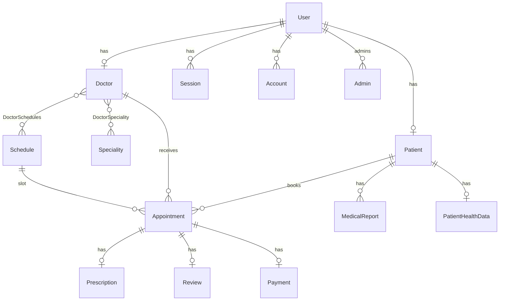

# Backend Product Requirements Document (PRD)

> **Superseded as a live contract.** Prefer `server/src/app/routes/index.ts` plus `BACKEND_SYSTEM_DOCUMENTATION.md` (verify routes first). Agent map: `../AGENTS.md` and `../docs/INDEX.md`. This file was last reviewed against code on 2026-04-13 and will drift.

**Document type:** As-built specification derived from the current server codebase.  
**Scope:** [server](.) package only — Express REST API, Prisma, PostgreSQL, Better Auth integration.  
**API base path:** `/api/v1` (see `src/app.ts`).  
**Last reviewed against code:** 2026-04-13.

---

## 1. Project overview

This backend supports a **healthcare management** domain: user identity and sessions (Better Auth + custom JWT cookies), patient self-registration, provisioning of **doctor** and **admin** accounts, **speciality** management (with optional image upload to Cloudinary), **doctor** directory and profile updates, **admin** listing and lifecycle, and **schedule** generation and management tied to doctors via a join model. The **Prisma schema** also defines **appointments**, **prescriptions**, **reviews**, **payments**, **medical reports**, and **patient health data**, but **no HTTP routes are mounted for appointments** in the current router; appointment booking logic exists only at the service/controller layer and is not exposed.

The server is **not** a Next.js application. The `package.json` name is `server`; the runtime is **Node.js** with **Express 5** and **TypeScript**.

---

## 2. Core features (as implemented)

### 2.1 Authentication and session (`/api/v1/auth`)

- **Patient registration:** Creates a Better Auth user via `auth.api.signUpEmail`, then creates a linked `Patient` row in a transaction; on failure, deletes the created user. Issues **JWT access/refresh** cookies and sets **Better Auth session** cookie (`better-auth.session_token`).
- **Login:** Email/password via `auth.api.signInEmail`; rejects blocked users; sets the same cookies as registration.
- **Current user (`/me`):** Requires `checkAuth`; loads full user from DB with nested `patient` or `doctor` relations and related aggregates (e.g. appointments, reviews) per `authService.getMe`.
- **Refresh token:** Validates refresh JWT and existing Prisma `Session` by `better-auth.session_token`; issues new access/refresh tokens; updates session `expiresAt` in DB.
- **Change password:** Uses Better Auth `changePassword` with Bearer session token; may clear `needPasswordChange` on `User`; re-issues JWT cookies.
- **Logout:** Better Auth `signOut` with Bearer session; clears `accessToken`, `refreshToken`, and `better-auth.session_token` cookies.
- **Email verification:** `auth.api.verifyEmailOTP` with `email` + `otp`; additional Prisma update sets `emailVerified` when Better Auth result indicates success without returning user (defensive path in code).
- **Forgot / reset password:** OTP-based flows via `requestPasswordResetEmailOTP` and `resetPasswordEmailOTP`; reset deletes all sessions for the user.

### 2.2 Users (`/api/v1/users`)

- **Create doctor:** `POST /create-doctor` — Zod-validated body (`password`, nested `doctor`, `specialities` array). No `checkAuth` on route (public provisioning as implemented).
- **Create admin:** `POST /create-admin` — Zod-validated body; protected by `checkAuth(Role.SUPER_ADMIN)`.

### 2.3 Doctors (`/api/v1/doctors`)

- **List doctors:** `GET /` — QueryBuilder-driven search, filter, pagination, sort; excludes `isDeleted: true`; includes `user` and optional dynamic includes from query string.
- **Get by id:** `GET /:id` — Includes specialities, appointments (with patient, schedule, prescription), etc.
- **Update:** `PUT /:id` — Body merged into doctor profile (service-level rules apply).
- **Soft delete:** `PATCH /:id` — Marks doctor deleted (implementation in service).

**Note:** These routes do **not** use `checkAuth` in `doctor.routes.ts` — effectively public in the current code.

### 2.4 Admin (`/api/v1/admin`)

- **List admins:** `GET /` — `checkAuth(Role.ADMIN, Role.SUPER_ADMIN, Role.PATIENT)`.
- **Get by id:** `GET /:id` — **No** `checkAuth` in route file (public as mounted).
- **Update:** `PUT /:id` — `checkAuth(Role.SUPER_ADMIN)`; body expected to include nested `admin` fields in service.
- **Delete:** `DELETE /:id` — `checkAuth(Role.SUPER_ADMIN)`; soft-deletes admin and user, clears sessions; prevents self-delete via `req.user`.

### 2.5 Specialities (`/api/v1/speciality`)

- **Create:** `POST /create-speciality` — Multer single file field `file`; Zod validates `title`, optional `description`; `checkAuth` for admin/super_admin is **commented out** (unauthenticated create as mounted). Icon URL taken from `req.file.path` (Cloudinary storage).
- **List:** `GET /` — `checkAuth(Role.PATIENT)` only.
- **Update:** `PATCH /:id` — `checkAuth(Role.ADMIN, Role.SUPER_ADMIN)`; controller uses manual try/catch (not `catchAsync`).
- **Delete:** `DELETE /:id` — `checkAuth(Role.ADMIN, Role.SUPER_ADMIN)`.

### 2.6 Schedules (`/api/v1/schedule`)

- **Create:** `POST /` — `checkAuth(Role.ADMIN, Role.SUPER_ADMIN)`; body: `startDate`, `endDate`, `startTime`, `endTime` (strings). Service expands each day into **30-minute** `Schedule` slots between start/end times, skipping duplicates.
- **List:** `GET /` — `checkAuth(Role.ADMIN, Role.SUPER_ADMIN, Role.DOCTOR)`; paginated/meta via QueryBuilder.
- **Get by id:** `GET /:id` — Same auth as list.
- **Update:** `PATCH /:id` — Admin/super_admin only; partial date/time fields.
- **Delete:** `DELETE /:id` — Admin/super_admin only.

### 2.7 Appointments (schema + partial code only)

- **Prisma:** `Appointment` links `Patient`, `Doctor`, `Schedule`; optional `Prescription`, `Review`, `Payment`; enums for appointment and payment status.
- **Code:** `AppointmentService.bookAppointment` creates an appointment and sets `DoctorSchedules.isBooked`; uses `uuidv7` imported from `"zod"` (likely incorrect at runtime). `getMyAppointments` is an **unfinished stub**. **`appointment.routes.ts` is empty**; routes are **commented out** in `src/app/routes/index.ts` — **no public API** for appointments.

### 2.8 Cross-cutting behavior

- **Success responses:** `sendResponse` → JSON `{ success, message, data?, meta? }`.
- **Errors:** `globalErroHandler` — Zod → `handleZodError`; `AppError` → status + message; generic `Error` → 500; in development may include stack. On error, attempts to delete uploaded Cloudinary asset(s) if `req.file` / `req.files` present.
- **Not found:** Final middleware for unknown routes.

---

## 3. Tech stack (versions from `package.json`)

| Area | Package / tool | Version (range in package.json) |
|------|----------------|----------------------------------|
| Runtime | Node (ESM) | `"type": "module"` |
| HTTP | express | ^5.2.1 |
| Language | typescript | ^5.9.3 |
| Dev runner | tsx | ^4.21.0 |
| ORM | prisma, @prisma/client | ^7.4.0 |
| DB driver | pg, @prisma/adapter-pg | ^8.18.0, ^7.4.0 |
| Auth | better-auth | ^1.4.18 |
| Validation | zod | ^4.3.6 |
| JWT | jsonwebtoken | ^9.0.3 |
| HTTP status | http-status | ^2.1.0 |
| Email | nodemailer | ^8.0.1 |
| Templates | ejs | ^4.0.1 |
| Upload / CDN | multer, multer-storage-cloudinary | ^2.1.1, ^4.0.0 |
| Cookies | cookie-parser | ^1.4.7 |
| Dates | date-fns | ^4.1.0 |
| Config | dotenv | ^17.3.1 |
| Query parsing | qs | ^6.15.0 |
| Lint | eslint, typescript-eslint | ^9.39.2, ^8.55.0 |

**Prisma setup:** Multi-file schema under `prisma/schema/`; root `schema.prisma` defines generator (client output: `src/generated/prisma`) and PostgreSQL datasource. Client is instantiated with `PrismaPg` adapter in `src/app/lib/prisma.ts`.

**Not present in this package:** Next.js (any version), React.

---

## 4. Data model (Prisma)

### 4.1 Enums (`enums.prisma`)

- **Role:** `ADMIN`, `SUPER_ADMIN`, `DOCTOR`, `PATIENT`
- **UserStatus:** `BLOCKED`, `DELETED`, `ACTIVE`
- **Gender:** `MALE`, `FEMALE`, `OTHER`
- **BloodGroup:** A/B/AB/O positive/negative variants
- **AppointmentStatus:** `SCHEDULED`, `INPROGRESS`, `COMPLETED`, `CANCELED`
- **PaymentStatus:** `PAID`, `UNPAID`

### 4.2 Core entities and relationships

- **User** (`auth.prisma`): Better Auth–aligned fields; `role`, `status`, `needPasswordChange`, `isDeleted`, `deletedAt`; relations to `Session`, `Account`, optional `Patient`, optional `Doctor`, and `admins` (Admin records).
- **Session / Account / Verification:** Standard Better Auth tables; sessions keyed by `token`, cascade delete with user.
- **Patient:** Profile fields; **1:1** `User`; 1:N `Appointment`, `Prescription`, `Review`, `MedicalReport`; optional **1:1** `PatientHealthData`.
- **Doctor:** Professional fields (fee, qualifications, gender, ratings, etc.); **1:1** `User`; N:M **Speciality** via `DoctorSpeciality`; N:M **Schedule** via `DoctorSchedules` (composite PK `doctorId` + `scheduleId`, `isBooked`); 1:N `Appointment`, `Prescription`, `Review`.
- **Admin:** Profile; **1:1** `User`.
- **Speciality:** Title (unique), description, icon; N:M doctors via `DoctorSpeciality`.
- **Schedule:** `startDateTime`, `endDateTime`; links to doctors through `DoctorSchedules`; 1:N `Appointment`.
- **Appointment:** `videoCallingId` (UUID), `status`, `paymentStatus`; FKs to patient, doctor, schedule; optional `Prescription`, `Review`, `Payment` (1:1 each by unique FK).
- **Prescription / Review / Payment / MedicalReport / PatientHealthData:** As in respective `.prisma` files; all tied to the domain graph above.

### 4.3 ER diagram (high level)

---

## 5. API documentation

### 5.1 Conventions

- **Prefix:** `/api/v1`
- **JSON body** for most POST/PUT/PATCH (except multipart for speciality create).
- **Cookies (HTTP-only, secure, SameSite none):** `accessToken`, `refreshToken`, `better-auth.session_token` — set on register, login, change-password, refresh; cleared on logout.
- **Authenticated routes** use `checkAuth`, which requires a valid **Better Auth session cookie** (Prisma `Session` lookup) **and** a valid **JWT** in `accessToken` cookie; attaches `req.user`: `{ userId, role, email }`. Optional role allow-list.

### 5.2 Endpoints

| Method | Path | Auth | Validation | Notes |
|--------|------|------|------------|--------|
| POST | `/api/v1/auth/register` | No | None in route | Body: `name`, `email`, `password`. 201 + tokens in body and cookies. |
| POST | `/api/v1/auth/login` | No | None | Body: `email`, `password`. 201 + cookies. |
| POST | `/api/v1/auth/me` | `checkAuth(any of four roles)` | None | Returns full user + nested profile. |
| POST | `/api/v1/auth/refresh-token` | No | None | Uses `refreshToken` + `better-auth.session_token` cookies. |
| POST | `/api/v1/auth/change-password` | `checkAuth(...)` | None in route | Body: `currentPassword`, `newPassword`; needs session cookie. |
| POST | `/api/v1/auth/logout` | `checkAuth(...)` | None | Requires session cookie. |
| POST | `/api/v1/auth/verify-email` | No | None | Body: `email`, `otp`. |
| POST | `/api/v1/auth/forget-password` | No | None | Body: `email`. |
| POST | `/api/v1/auth/reset-password` | No | None | Body: `email`, `otp`, `newPassword`. |
| POST | `/api/v1/users/create-doctor` | No | `createDoctorZodSchema` | Nested `doctor`, `password`, `specialities[]`. |
| POST | `/api/v1/users/create-admin` | `SUPER_ADMIN` | `createAdminZodSchema` | Nested `admin`, `password`. |
| GET | `/api/v1/doctors` | No | Query via QueryBuilder | `meta` for pagination when used. |
| GET | `/api/v1/doctors/:id` | No | — | |
| PUT | `/api/v1/doctors/:id` | No | — | |
| PATCH | `/api/v1/doctors/:id` | No | — | Soft delete in service. |
| GET | `/api/v1/admin` | ADMIN, SUPER_ADMIN, PATIENT | — | |
| GET | `/api/v1/admin/:id` | **None** | — | As mounted. |
| PUT | `/api/v1/admin/:id` | SUPER_ADMIN | — | Body includes `admin` subtree in service. |
| DELETE | `/api/v1/admin/:id` | SUPER_ADMIN | — | |
| POST | `/api/v1/speciality/create-speciality` | **None** (auth commented out) | Zod + multipart | Field `file` optional for icon; body may use `data` JSON string when file present (see `validateRequest`). |
| GET | `/api/v1/speciality` | PATIENT | — | |
| DELETE | `/api/v1/speciality/:id` | ADMIN, SUPER_ADMIN | — | |
| PATCH | `/api/v1/speciality/:id` | ADMIN, SUPER_ADMIN | — | |
| POST | `/api/v1/schedule` | ADMIN, SUPER_ADMIN | Schedule create schema | |
| GET | `/api/v1/schedule` | ADMIN, SUPER_ADMIN, DOCTOR | Query params | |
| GET | `/api/v1/schedule/:id` | ADMIN, SUPER_ADMIN, DOCTOR | — | |
| PATCH | `/api/v1/schedule/:id` | ADMIN, SUPER_ADMIN | Update schema | |
| DELETE | `/api/v1/schedule/:id` | ADMIN, SUPER_ADMIN | — | |

### 5.3 Error response shape (typical)

From `globalErroHandler`: `{ success: false, message, errorSource[], stack?, error? }` (stack/error more likely in development).

### 5.4 Better Auth HTTP handler

Better Auth is configured in `src/app/lib/auth.ts` and invoked via **`auth.api.*`** from services — there is **no** `app.use("/api/auth", ...)` style mount in `app.ts` for the Better Auth Node handler in the reviewed code.

---

## 6. Architectural patterns

- **Layering:** Route definitions → controller (`catchAsync` + `sendResponse`) → service (Prisma / Better Auth / JWT).
- **Validation:** Central `validateRequest` wrapping Zod object schemas; supports `req.body.data` JSON string for multipart flows.
- **Authorization:** `checkAuth(...roles)` — Prisma session validation + JWT verification + role allow-list + user status / soft-delete checks; session nearing expiry sets refresh hint headers (`X-Session-Refresh`, etc.).
- **Pagination / filtering:** `QueryBuilder` + `IQueryParams` for doctors and schedules (and similar patterns elsewhere as wired).
- **Configuration:** `env.ts` validates required env vars at startup (DB, JWT secrets, Better Auth, SMTP, Cloudinary).
- **Type augmentation:** `Express.Request.user` in `src/app/interfaces/index.d.ts`.

---

## 7. Potential improvements (gap analysis)

1. **Security / consistency:** Doctor endpoints and `GET /admin/:id` lack `checkAuth`; speciality **create** has admin auth commented out — inconsistent with typical RBAC.
2. **Dual gatekeeping:** `checkAuth` requires **both** session token and JWT access cookie; misconfiguration or partial logout can confuse clients; document clearly or unify on one session model.
3. **Appointments:** Routes not registered; `bookAppointment` not reachable; `uuidv7` import from `"zod"` is almost certainly wrong; `getMyAppointments` incomplete; transaction in `bookAppointment` does not return the created appointment from the callback.
4. **Env vs code:** Session durations appear in `lib/auth.ts` literals; separate env keys exist (`BETTER_AUTH_SESSION_*`) in `env.ts` but are not wired into the Better Auth config in the reviewed file.
5. **Express query parser:** `app.set("query parser", (q) => { qs.parse(q); })` does not return the parsed object — likely ineffective.
6. **Controller consistency:** `SpecialityController.updateSpeciality` bypasses `catchAsync` and global error shape.
7. **Dead / suspicious imports:** e.g. `role` from `better-auth/plugins` in `user.route.ts`, `th` from `zod/locales` in `admin.service.ts`, `get` from `node:http` in `auth.services.ts` — cleanup would reduce noise.
8. **Testing:** `npm test` is a placeholder; no automated API or unit tests in scope of this PRD.

---

## 8. Out of scope for this document

- Frontend or mobile clients.
- Deployment, CI/CD, and infrastructure.
- Behavior not present in this repository (e.g. Stripe webhooks, video calling runtime) beyond schema fields and code comments (`// todo payment integration`).

---

*This PRD describes the system as implemented in source; it is not a forward-looking roadmap unless explicitly stated in section 7.*
